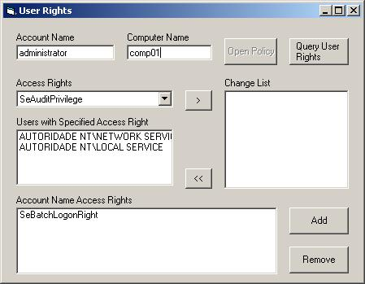

<div align="center">

## Local Security Policy Management


</div>

### Description

Manage local security policy (LSA) user's rights privileges. This code is not mine but it helps me to make an login validation on windows 2000. It's the only one code in the internet that explain the use of these api http://www.xephon.com/cgi-bin/xephon3/licence/getcode.cgi?pubfile=November.1999&amp;datafile=W030A02. You must have an administrator account to use this code.
 
### More Info
 


<span>             |<span>
---                |---
**Submitted On**   |2006-10-26 16:10:02
**By**             |[Zeilo](https://github.com/Planet-Source-Code/PSCIndex/blob/master/ByAuthor/zeilo.md)
**Level**          |Intermediate
**User Rating**    |5.0 (15 globes from 3 users)
**Compatibility**  |VB 5\.0, VB 6\.0
**Category**       |[Windows API Call/ Explanation](https://github.com/Planet-Source-Code/PSCIndex/blob/master/ByCategory/windows-api-call-explanation__1-39.md)
**World**          |[Visual Basic](https://github.com/Planet-Source-Code/PSCIndex/blob/master/ByWorld/visual-basic.md)
**Archive File**   |[Local\_Secu20271310262006\.zip](https://github.com/Planet-Source-Code/zeilo-local-security-policy-management__1-66889/archive/master.zip)

### API Declarations

```
Public Declare Function LsaOpenPolicy Lib "advapi32.dll" _
  (SystemName As LSA_UNICODE_STRING, ObjectAttributes As _
  LSA_OBJECT_ATTRIBUTES, ByVal DesiredAccess As Long, _
  PolicyHandle As Long) As Long
Public Declare Function LsaClose Lib "advapi32.dll" _
  (ByVal PolicyHandle As Long) As Long
Public Declare Function LsaAddAccountRights Lib "advapi32.dll" _
  (ByVal PolicyHandle As Long, AccountSid As psid, userRights As _
  LSA_UNICODE_STRING, ByVal CountOfRights As Long) As Long
Public Declare Function LsaRemoveAccountRights Lib "advapi32.dll" _
  (ByVal PolicyHandle As Long, AccountSid As psid, ByVal AllRights _
  As Byte, userRights As LSA_UNICODE_STRING, ByVal CountOfRights _
  As Long) As Long
Public Declare Function LsaEnumerateAccountsWithUserRight Lib _
  "advapi32.dll" (ByVal PolicyHandle As Long, userRights As _
  LSA_UNICODE_STRING, EnumerationBuffer As Long, CountOfSIDs As _
  Long) As Long
Public Declare Function LsaEnumerateAccountRights Lib "advapi32.dll" _
  (ByVal PolicyHandle As Long, AccountSid As psid, EnumerationBuffer _
  As Long, CountOfSIDs As Long) As Long
Public Declare Function LsaFreeMemory Lib "advapi32.dll" (ByVal _
  lpBuffer As Long) As Long
```


